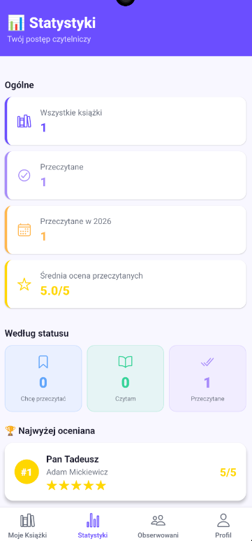
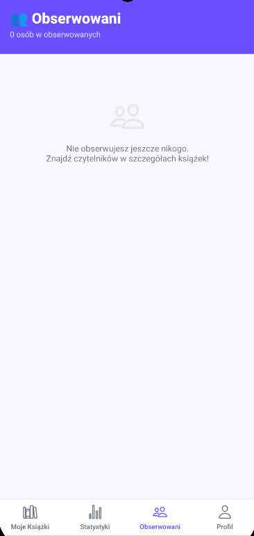
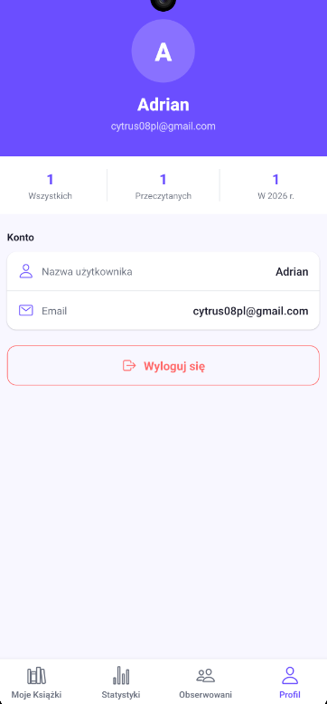

# 📚 BookDiary

> Mobilny dziennik czytelnika — śledź swoje lektury, oceniaj książki i odkrywaj innych czytelników.

**Autor:** Adrian Witów

---

## O projekcie

BookDiary to aplikacja mobilna napisana w **React Native z Expo**, która pozwala użytkownikom prowadzić osobisty dziennik przeczytanych książek. Każdy może dodawać tytuły, oznaczać ich status, wystawiać oceny oraz przeglądać statystyki swojej czytelniczej aktywności. Aplikacja posiada również warstwę społecznościową — możesz zobaczyć, kto czytał tę samą książkę co Ty, obserwować innych czytelników i kopiować ich tytuły do własnej listy.

Projekt powstał jako zaliczenie przedmiotu, zrealizowany w oparciu o **Supabase** jako backend (baza danych + autentykacja) oraz **Zustand** do zarządzania stanem aplikacji.

---

## Zrzuty ekranu

<p align="center">
  
  
  
  
</p>

<p align="center">
  <sub>Od lewej: Moje Książki &nbsp;·&nbsp; Statystyki &nbsp;·&nbsp; Obserwowani &nbsp;·&nbsp; Profil</sub>
</p>

---

## Ekrany

| Ekran | Podgląd | Opis |
|---|---|---|
| **Moje Książki** |  | Główna lista książek z filtrowaniem po statusie, wyszukiwarką i licznikiem przeczytanych w danym roku |
| **Statystyki** |  | Przegląd aktywności czytelniczej — liczniki, średnia ocena i najwyżej oceniona książka |
| **Obserwowani** |  | Lista obserwowanych czytelników i podgląd ich przeczytanych tytułów |
| **Profil** |  | Dane konta, podsumowanie aktywności i wylogowanie |

---

## Funkcjonalności

### Biblioteka
- Dodawanie książek z tytułem, autorem, statusem, oceną (1–5 ⭐) i notatkami
- Trzy statusy: `Chcę przeczytać` / `Czytam` / `Przeczytane`
- Filtrowanie listy według statusu
- Wyszukiwanie po tytule lub autorze
- Sortowanie po dacie dodania (najnowsze na górze)
- Licznik przeczytanych książek w bieżącym roku widoczny na głównym ekranie

### Statystyki
- Łączna liczba wszystkich książek
- Liczba przeczytanych książek ogółem i w bieżącym roku
- Średnia ocena przeczytanych książek
- Podział liczby książek według każdego statusu
- Najwyżej oceniona książka (tytuł, autor, ocena)

### Funkcje społecznościowe
- Sekcja **„Inni czytelnicy"** na ekranie szczegółów książki — lista anonimowych użytkowników, którzy przeczytali ten sam tytuł
- Kliknięcie w czytelnika otwiera listę wszystkich jego przeczytanych książek (tylko podgląd — bez notatek i edycji)
- Możliwość **obserwowania** użytkownika bezpośrednio z tej listy
- Osobna zakładka **Obserwowani** z możliwością przeglądania przeczytanych książek każdej obserwowanej osoby
- Przycisk **„Dodaj do mojej listy"** przy każdej książce obserwowanego — kopiuje tytuł i autora, automatycznie ustawia status `Chcę przeczytać`
- Możliwość usunięcia użytkownika z obserwowanych w dowolnym momencie

---

## Technologie

| Technologia | Wersja | Zastosowanie |
|---|---|---|
| React Native | 0.74 | Framework mobilny |
| Expo | ~51 | Środowisko deweloperskie |
| Expo Router | v3 | File-based routing |
| Supabase | ^2.43 | Baza danych + autentykacja |
| Zustand | ^4.5 | Globalny state management |
| TypeScript | ^5.3 | Typowanie statyczne |
| @expo/vector-icons | ^14 | Ikony (Ionicons) |

---

## Struktura bazy danych

### Tabela `books`

| Kolumna | Typ | Opis |
|---|---|---|
| `id` | UUID | Klucz główny |
| `user_id` | UUID | Klucz obcy do `auth.users` |
| `title` | TEXT | Tytuł książki |
| `author` | TEXT | Autor |
| `status` | TEXT | `to_read` / `reading` / `finished` |
| `rating` | NUMERIC(2,1) | Ocena 1–5 (opcjonalna) |
| `notes` | TEXT | Notatki użytkownika (opcjonalne) |
| `date_added` | TIMESTAMPTZ | Data dodania wpisu |

### Tabela `user_follows`

| Kolumna | Typ | Opis |
|---|---|---|
| `id` | UUID | Klucz główny |
| `follower_id` | UUID | Klucz obcy — obserwujący |
| `following_id` | UUID | Klucz obcy — obserwowany |
| `created_at` | TIMESTAMPTZ | Data rozpoczęcia obserwowania |

Obie tabele są zabezpieczone przez **Row Level Security (RLS)** — każdy użytkownik ma dostęp wyłącznie do swoich danych, z wyjątkiem przeglądania przeczytanych książek innych w ramach funkcji społecznościowych.

---

## Struktura projektu

```
BookDiary/
├── app/
│   ├── _layout.tsx          # Root layout + nasłuchiwanie sesji auth
│   ├── index.tsx            # Przekierowanie na podstawie stanu auth
│   ├── login.tsx            # Ekran logowania
│   ├── register.tsx         # Ekran rejestracji
│   ├── add-book.tsx         # Dodawanie nowej książki
│   ├── book-detail.tsx      # Szczegóły i edycja książki
│   └── (tabs)/
│       ├── _layout.tsx      # Dolna nawigacja zakładkowa
│       ├── my-books.tsx     # Lista moich książek
│       ├── stats.tsx        # Statystyki
│       ├── following.tsx    # Obserwowani czytelnicy
│       └── profile.tsx      # Profil i wylogowanie
├── src/
│   ├── lib/
│   │   ├── supabase.ts      # Klient Supabase
│   │   └── constants.ts     # Kolory i stałe aplikacji
│   ├── store/
│   │   └── useStore.ts      # Globalny store (Zustand)
│   ├── screens/             # Logika i widoki poszczególnych ekranów
│   └── components/          # Komponenty wielokrotnego użytku
├── Photos/                  # Zrzuty ekranu
│   ├── 1.png
│   ├── 2.png
│   ├── 3.png
│   └── 4.png
├── supabase_schema.sql      # Schemat SQL do uruchomienia w Supabase
├── app.json                 # Konfiguracja Expo
└── README.md
```

---

## Instalacja i uruchomienie

### Wymagania wstępne
- Node.js >= 18
- Expo CLI (`npm install -g expo-cli`)
- Konto na [supabase.com](https://supabase.com)
- Aplikacja **Expo Go** na telefonie lub emulator Android/iOS

### Krok 1 — Konfiguracja Supabase

1. Utwórz nowy projekt na [supabase.com](https://supabase.com)
2. Przejdź do **SQL Editor**, wklej i uruchom zawartość pliku `supabase_schema.sql`
3. Przejdź do **Settings → API** i skopiuj `Project URL` oraz `anon public key`

### Krok 2 — Konfiguracja aplikacji

Otwórz plik `src/lib/supabase.ts` i uzupełnij swoje dane:

```ts
const SUPABASE_URL = 'https://TWOJ_PROJEKT.supabase.co';
const SUPABASE_ANON_KEY = 'TWOJ_ANON_KEY';
```

### Krok 3 — Instalacja zależności

```bash
npm install
```

### Krok 4 — Uruchomienie

```bash
# Tryb deweloperski (Expo Go)
npm start

# Android
npm run android

# iOS
npm run ios
```

Zeskanuj kod QR aplikacją **Expo Go** lub uruchom na emulatorze.

---

## Licencja

Projekt edukacyjny — brak licencji komercyjnej.
